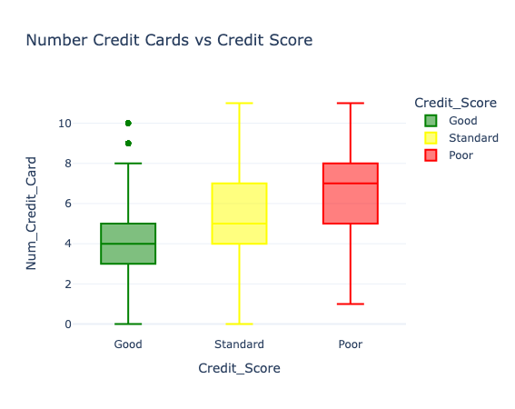

# Credit score classification

## Import Libraries
- pandas 
- numpy 
- plotly.express 
- plotly.graph_objects
- plotly.io
- from sklearn.model_selection import train_test_split
- from sklearn.ensemble import RandomForestClassifier
- pio.templates.default = "plotly_white"

## Read Dataset

- data.head()
- data.info()
- data.describe()
- data.isnull().sum() # no null
- data["Credit_Score"].value_counts()
   - Standard    53174
   - Poor        28998
   - Good        17828
   - Name: Credit_Score, dtype: int64

## Data Exploration

- I will start by exploring the occupation feature to know if the occupation of the person affects credit scores.

- There's no much difference in the credit scores of all occupations mentioned in the data

----------------------------------------------------------------------------------------

- Now let's explore whether the annual income of the person impacts your credit scores or not.

- According to the above visualization, the more earn annually, the better your credit score is.

----------------------------------------------------------------------------------------

- Now let's explore whether the monthy in-hand salary impacts credit score or not.

- Like annual income, the more monthly in-hand salary you earn, the better your credit score will become

----------------------------------------------------------------------------------------
- Now let's see if having more bank accounts impacts credit score or not.

- Maintaining more that five account is not good for having a good credit score. A person   should have 2 or 3 bank accounts only. So having more bank accounts doesn't positively  impact credit scores.

----------------------------------------------------------------------------------------

- Now let's see the impact on credit score based on the number of credit cards you have

- Just like the number of banks accounts, having more credit cards will not possitively impat your credit scores.Having more than three credit card does not improve your credit score. It can even negatively affect it

----------------------------------------------------------------------------------------

- Now let's see the impact on credit scores based on how much average interest you pay on loans and.

- If average interest rate is 4% a 11% the credit score is good. Having an average interest rate of more than 15% is bad for your credit scores.

----------------------------------------------------------------------------------------

- Now let's see how many loans you can take at a time for good credit score.

- To have a good credit score, you should not take more than 1 - 3 loans at a time. Having more than three loans at a time will negatively impact your credit scores

----------------------------------------------------------------------------------------

- Now let's see if delaying payments on the due date impacts your credit socres or not

- So you can delay your credit card payment 5 - 14 days from the due date. Delaying your payments for more than 17 days from the due date will impact your credit score negativelly.

----------------------------------------------------------------------------------------
- Now let's have a look at if frequently delaying payments will impact credit scores or not.

- So delaying 4 - 12 payments from the due date will no affect your credit scores. But delaying more than 12 payments from the due date will affect your credit scores negatively

----------------------------------------------------------------------------------------

- Now let's see if having more debt will affect credit score or not.

- An outstanding debt of $380 - $1150 will not affect your credit scores.  But always having a debit of more tha $1338 will affect your credit scores negatively.

----------------------------------------------------------------------------------------

- Now let's see if having a high credit utilization ratio will affect credit scores or not. 

-  According to the above figure, your credit utilization ratio doesn't affect your credit scores.abs

----------------------------------------------------------------------------------------

- Now let's see how the credit history age of a person affects credit scores

- So, having a long credit history results is better credit scores.

----------------------------------------------------------------------------------------

- Now let's see if your monthly investments affect your credit scores or not.

- The amount of money you invest monthly doens't affect your credit scores.

----------------------------------------------------------------------------------------

- Now let's see if having a low amount at the end of the monthly affects credit scores or not. 

- So having a high monthly balance in your account at the end of the month is good for your credit scores.A Monthly balance of lesse than $250 is bad for credit scores.

----------------------------------------------------------------------------------------

- Now, let’s make predictions from our model by giving inputs to our model according to the features we used to train the model:

- print("Credit Score Prediction : ")
- a = float(input("Annual Income: "))
- b = float(input("Monthly Inhand Salary: "))
- c = float(input("Number of Bank Accounts: "))
- d = float(input("Number of Credit cards: "))
- e = float(input("Interest rate: "))
- f = float(input("Number of Loans: "))
- g = float(input("Average number of days delayed by the person: "))
- h = float(input("Number of delayed payments: "))
- i = input("Credit Mix (Bad: 0, Standard: 1, Good: 3) : ")
- j = float(input("Outstanding Debt: "))
- k = float(input("Credit History Age: "))
- l = float(input("Monthly Balance: "))

- features = np.array([[a, b, c, d, e, f, g, h, i, j, k, l]])
- print("Predicted Credit Score = ", model.predict(features))

----------------------------------------------------------------------------------------

- Credit Score Prediction : 
- Annual Income: 19114.12
- Monthly Inhand Salary: 1824.843333
- Number of Bank Accounts: 2
- Number of Credit cards: 2
- Interest rate: 9
- Number of Loans: 2
- Average number of days delayed by the person: 12
- Number of delayed payments: 3
- Credit Mix (Bad: 0, Standard: 1, Good: 3) : 3
- Outstanding Debt: 250
- Credit History Age: 200
- Monthly Balance: 310
- Predicted Credit Score =  ['Good']

----------------------------------------------------------------------------------------

## Summary

- Classifying customers based on their credit scores helps banks and credit card companies immediately to issue loans to customers with good creditworthiness. A person with a good credit score will get loans from any bank and financial institution.

