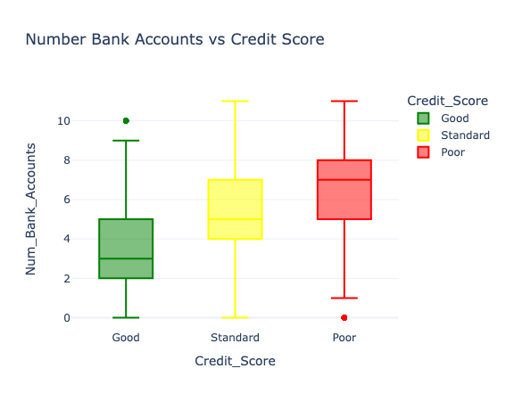

# Credit score classification

## Import Libraries
- pandas 
- numpy 
- plotly.express 
- plotly.graph_objects
- plotly.io
- from sklearn.model_selection import train_test_split
- from sklearn.ensemble import RandomForestClassifier
- pio.templates.default = "plotly_white"

## Read Dataset

- data.head()
- data.info()
- data.describe()
- data.isnull().sum() # no null
- data["Credit_Score"].value_counts()
   - Standard    53174
   - Poor        28998
   - Good        17828
   - Name: Credit_Score, dtype: int64

## Data Exploration

- I will start by exploring the occupation feature to know if the occupation of the person affects credit scores.

- There's no much difference in the credit scores of all occupations mentioned in the data

----------------------------------------------------------------------------------------

- Now let's explore whether the annual income of the person impacts your credit scores or not.

- According to the above visualization, the more earn annually, the better your credit score is.

----------------------------------------------------------------------------------------

- Now let's explore whether the monthy in-hand salary impacts credit score or not.

- Like annual income, the more monthly in-hand salary you earn, the better your credit score will become

